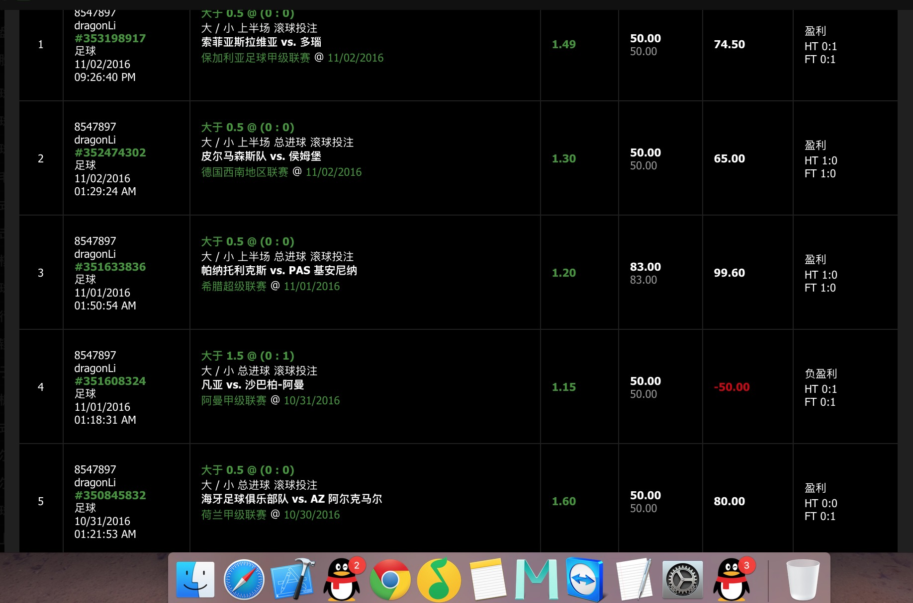
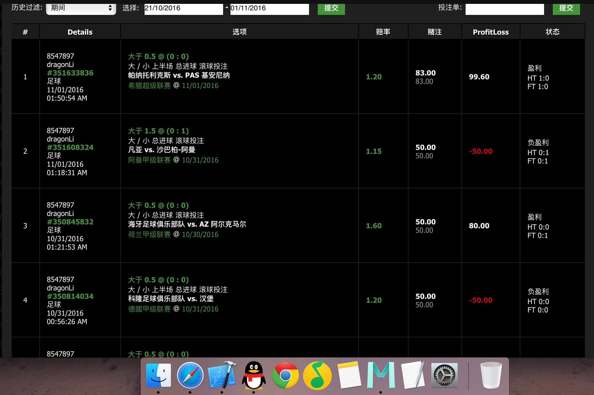
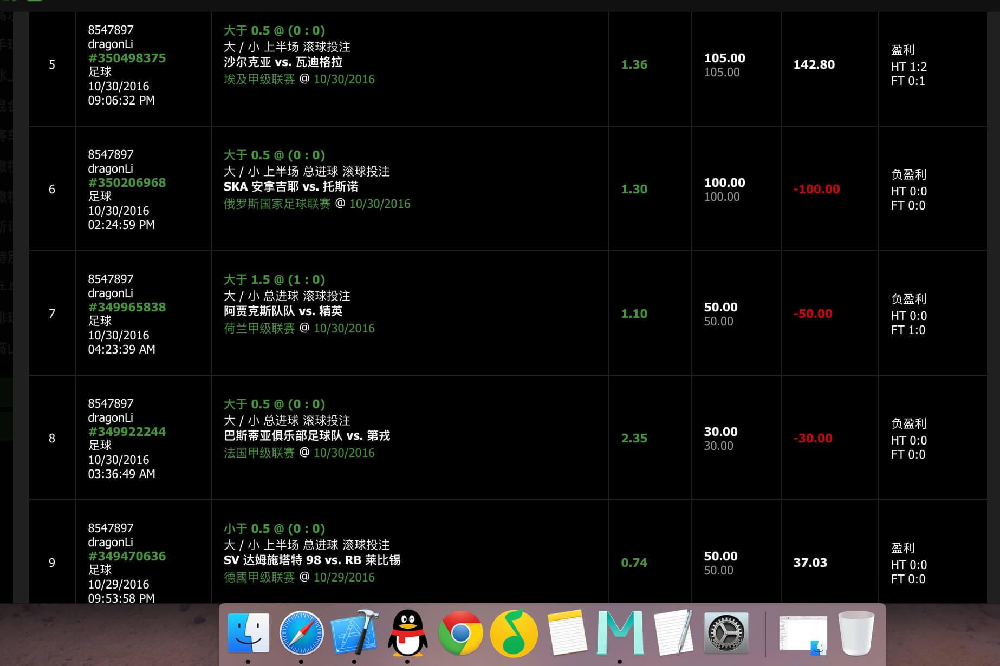
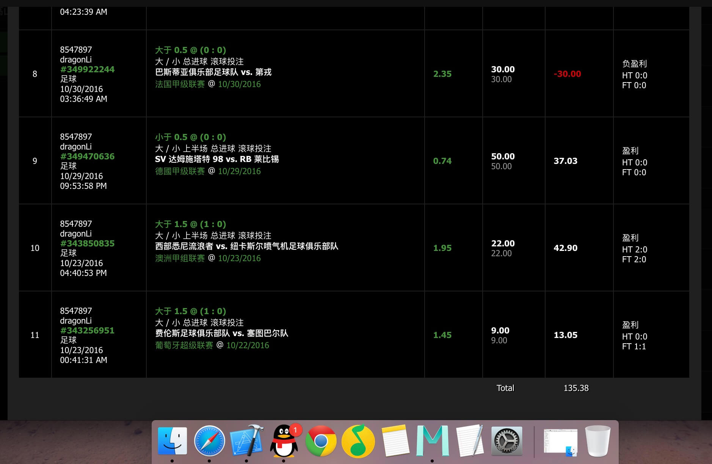

## 2016.10和11月份半场大小球总结

- 首先说明,时间跨度10.23-11.1,只谈半场

## Ⅰ:Record datas

- 10.31-11.2号之间连续5单半场投注,对了四场,实际盈利率计算如下,说明:赔率为当时购买的水位.(数据来源参考文章图1),一般这个数据很难保证
- 盈利: 比如:买了50 水位1.60 返还130 ,则盈利80

|   投注金额  |   赔率   |   盈利     |
|:-----|:------:|---------:   |
|50|1.60|80|
|50|1.15|-50| 
|83|1.20|99.60|
|50|1.30|65|
|50|1.49|74.50|

- 通过表格可以看到,投入本金为283,纯盈利为269.1 ,即使80%胜率+高水买入
-  <u>通过表格也可以看到一个真实的数据反馈的问题,如果采取低水(低于1.00),均注买入,如果胜率不能保证67%,基本可以放弃玩.因为某种程度而言,不仅仅损失了钱财,还损失了你的宝贵时间!!!!</u>

## Ⅱ:最近沉迷半场大小球,基本都是娱乐单连续二个周末期间时间,没有压老婆孩子.......,只是为了验证水位和其他因素对半场进球是不是真的有帮助预判作用而已.谈下体会和滚球的一些个人见解.可能会对你滚球有所帮助.

- 期间半场大小球,为了信服,全部连续单子截图,不作假.(从9-滚到64开始截图)...(时间跨度和场次可以某种程度排除偶然因素,当然不排除运气使然.)

## Ⅲ:针对投注历史,进行宏观总结(文中水位,为bwin 走地及时水位)
- **关于水位和大小球盘口我建议任何比赛,都在恰当的时机.选择高水位(1.00以上)和大小球半球盘口**(比如当前0:0,你可以等 1.05水位去0.5 大 ,但是尽量避免选择 0.68 0.5 /1 这类水位和盘口),why ? 

	- 假设你买了 0.5大 投注100 ,水位1.05 ,半场进球一个.你就赢全.
	- 假设你买了 0.5/1大 投注100 ,水位1.85 ,半场进球一个.你就赢半.
	- 实际上在我看来,也有可能不进球,很有可能就是输全,既然博弈,就不要留余地,选择赢办输全的模式!

- 简单回顾分析之水位变化和时间选择
	- 图3澳洲甲 场景回顾: 当时1:0 但是进球后,1.5水位异常低一会,而且可以看到半场平局水位下降,最终半场1:1平局
	
	- 图3德甲 场景回顾: 0:0 买了小,当时看下射门数据和水位.选择小

	- 其他场次大致都是高水买入,当然红黑都存在 再去回顾.

## Ⅳ: conclusion

- **半场买入时间,一般我会选择20分钟后到30分钟时间**,水位一般满水到位
- **假封盘**浅谈,我对足球不懂,即使在涉及足球公司上班,也不懂足球......,对于滚球当中出现假封盘原因(红牌,前点球,进攻异常,操盘手故意为之)  
- 关于水位变化,这个应该是最重要的,一般而言,比赛开后,比如半场,一直维持0:0, 假设当时主要盘口0.5 大 是0.56,随着时间推移,会升水,比如0.61,0.68,0.74,0.80.....直到满水1.00 甚至可以升到9.00 .滚球多了你就会发现,其实水位高低一般情况下决定了半场进球个数,水位越高,说明进球希望不大而已,但不是没有,中超比赛6.00水位 然后40分钟后进球的也不是少数.  但是**水位变化异常**就值得我们去考虑买大小球的某种依据.
- 半场才16分钟,居然接近满水了,一般我20分钟就去大.然后正确率50%,还需要具体比赛具体分析
- 半场0.5水位,升水到1.60了,苏子和时间推移,又退回1.40...,再看下半场主客方水位变化,一般我也会去大.
- 二个球队最近二次交战,半场均无进球,一般野鸡联赛选择小,正规比赛选择大.但是尽量选择放弃!

## Ⅴ:其他建议
不建议投注场次过多,控制场次! 

## Ⅵ. 
### All of my original article, any organization or individual cannot reprint, the offenders shall be investigated for legal responsibility,The late if the ball you have any questions, can contact in the following way `dragonli_52171@163.com` 

